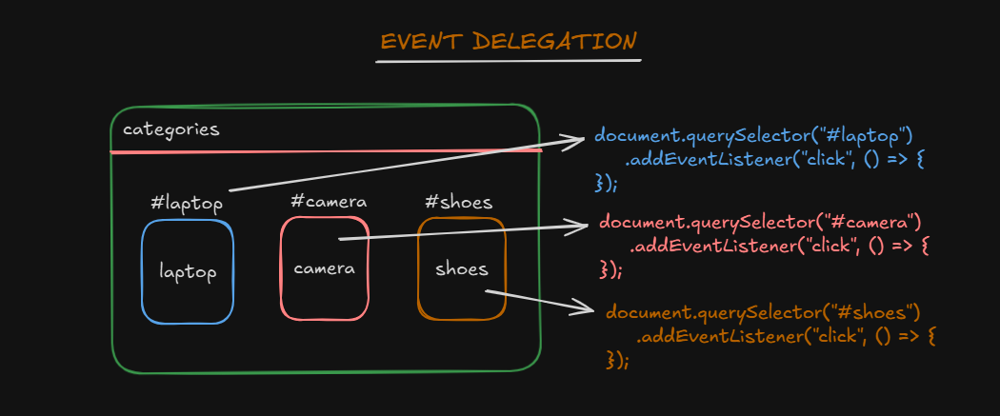

# Event Delegation



- Event delegation is techniques to handle the events of DOM in better way.

- Event delegation is not possible without evet bubbling in the javascript. It can be only achived beacause of event bubbling in Javascript.

- If the event bubbling is not exist the event delegation is not exist.

## Let's take a senario :

Sometime in our web page we have huge number of events need to handle and at some point of time we are reached at the point where all the events are segrigate to each other and it's very difficult to manage the web page.

so, the event delegation provide the technique to attached the eventListner to the parent of that elements intead of attaching the eventListner to the each an every HTML element.

## index.html

```javascript
<!DOCTYPE html>
<html lang="en">
  <head>
    <meta charset="UTF-8" />
    <meta name="viewport" content="width=device-width, initial-scale=1.0" />
    <title>Event Delegation | ABh!</title>
  </head>
  <body>
    <div>
      <ul id="categories">
        <li id="laptop">laptop</li>
        <li id="camera">camera</li>
        <li id="shoes">shoes</li>
      </ul>
    </div>

    <div id="form">
      <label for="name">FirstName : </label>
      <input type="text" id="name" data-uppercase /> <br /><br />
      <label for="name">LastName : </label>
      <input type="text" id="name" data-uppercase />
    </div>
  </body>
  <script src="./index.js"></script>
</html>
```

## index.js

```javascript
document.querySelector("#categories").addEventListener("click", (e) => {
  console.log(`${e.target.id} is clicked`);
  if (e.target.tagName == "LI") {
    window.location.href = "/" + e.target.id;
  }
});

document.querySelector("#form").addEventListener("keyup", (e) => {
  console.log(e);
  if (e.target.dataset.uppercase != undefined) {
    e.target.value = e.target.value.toUpperCase();
  }
});
```

# pros and cons of event delegation

- PROS :

1. Consume memory
2. Writing less code
3. DOM manipulation

- CONS :

1. All the events are not bubbled out like `focus, scroll, blur` they have risk.
2. If you are using `event.stopPropagation()` in your code anytime eventually it won't work.
