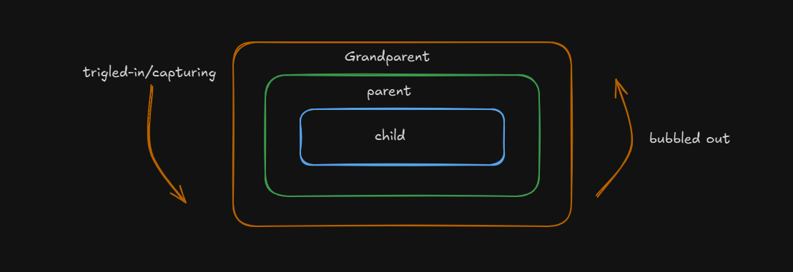

# EVENT PROPAGATION

- It describe how the event moved through the DOM when it will triggred.
- There are three phase in the event propagation

1. Target phase
2. Bubbling phase
3. Capturing phase

- 

## Event Bubbling

- After clicking the target the event bubble back up through the DOM allowing present element to handle the event.
- It goes down to up.
- If we click the child div after clicked the parent and grandparent will also triggered without clicking.

NOTE :- Imagine the bubble in the water whnever it form it will comes-up.

```javascript
document.querySelector("#grandparent").addEventListener("click", () => {
  console.log("Grandparent Clicked !");
});
document.querySelector("#parent").addEventListener("click", () => {
  console.log("Parent Clicked !");
});
document.querySelector("#child").addEventListener("click", () => {
  console.log("Child Clicked !");
});
```

## Event Capturing

- It is the reverse mechanism of event bubbling .
- It goes down to up.
- If we click the child div the output will be (Grandparent -> Parent -> child).

-by default event bubbling is used in event propagation, if we want to capturing we need to pass the third argument inside the addEventListner as boolean value.
addEventListner('clicl', () => { }, true).

```javascript
document.querySelector("#grandparent").addEventListener(
  "click",
  () => {
    console.log("Grandparent Clicked !");
  },
  true
);
document.querySelector("#parent").addEventListener(
  "click",
  () => {
    console.log("Parent Clicked !");
  },
  true
);
document.querySelector("#child").addEventListener(
  "click",
  () => {
    console.log("Child Clicked !");
  },
  true
);
```

## Event Propagation

- If wre want the event target should only get triggered then we need to stop the propagation. `event.stopPropagation` to stop the propagation.
